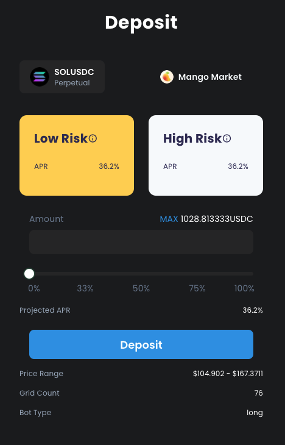

# Grid Bot

## What is a grid trading bot?&#x20;

“Buy Low, Sell High“ might sound too obvious. But it is one of the most fundamental strategies behind almost all of the investments we make, ranging from securities, commodities, to crypto currencies.

What if you could do that automatically 7/24? You hear it right! Grid Trading Bot is actually a perfect tool for you to do that with minimal efforts.&#x20;

## How does grid bot work?

Grid trading is when orders are placed above and below a set price, creating a grid of orders at incrementally increasing and decreasing prices. ([Investopedia](https://www.investopedia.com/terms/g/grid-trading.asp)) This sounds complicated but it’s actually quite simple. Let’s unfold it with an example.

The bot is placing buy-orders at every $200 below the market price and sell orders at every $200 above. The bot constantly “buys low” and “sells high” to capture profit from price fluctuations.

There are a bunch of parameters you can tweak to generate various strategies. But the most important ones are really the Grid Range (lower price & upper price) and the Number of Grids.

The tighter the range, the higher capital efficiency you will enjoy. However it’s easy to get out of range if it’s too narrow. On the contrary, the broader range will almost always guarantee that your money is working for you, but at a much lower efficiency.

Similarly, the balance between the number of grids is another thing you need to consider. The more grid you specify, the higher the frequency of trades will be. However your per grid is also lower. So it’s a tradeoff between many small trades vs. fewer larger trades.

## Advantages of grid bot&#x20;

* Market Independent: No one can really predict the future. Grid bot is the perfect strategy for a sideway market that doesn’t have a clear trend&#x20;
* Simple but Powerful: There is no complicated algorithm. You can deploy a short term strategy to capture hundreds of trades each day for small volatilities or set up a long term bot to passively earn incomes and capture larger trends.&#x20;
* Market Making: You might not notice. But this is a great way to inject liquidity into illiquid markets, which are much more volatile and can often observe huge 5+% spikes within a minute. You as a LP can easily capture these profits by opening up a grid bot.

## Current Landscape

* 3rd Party Trading Bots: There are 3rd party trading bots that let you connect to CEXs that you use daily via API Keys. But they usually charge users subscription fees, ranging from $20 to $100 per month. There are limits on no. of bots or trading volume for a free plan.
* CEX: Centralized exchanges like Binance and Pionex have also started offering built-in trading bots. These are easy to use but still follow a trusted model. Remember, not your keys, not your coins. Also they charge high fees, which eats out lots of your grid profit.
* Cell: Fully decentralized and started on Solana blockchain to leverage the 400ms block time as well as the great DeFi ecosystem that has been built atop. Cell is free to use. Bots don’t charge trading fees when placing orders. We also receive market making rewards from placing bids and asks on the order book, which are then distributed to our bot users.
