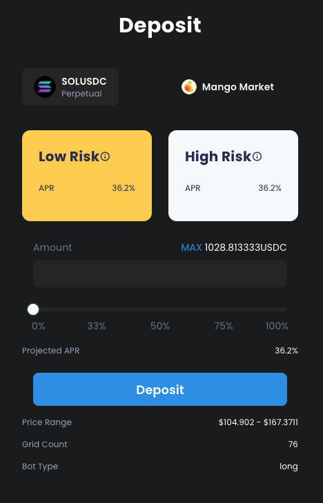

# Factory

#### Step 1: Browse Assets

.png>)

#### Step 2: Create Bot & Deposit

Click the pair you wish to create strategy for, choose your risk level, and then enter deposit amount.


* **`Low Risk`** suggests a very safe strategy with wide price range. This usually means less concentrated liquidity and less Impermanent Loss.
* **`High Risk`** suggests a moderate-risk strategy with tighter range. This means more concentrated liquidity with slightly higher Impermanent Loss, and also a higher yield with higher capital efficiency.&#x20;
* **`Amount`** is the amount of investment you are willing to deposit into the bot. There is minimum deposit amount due to the ticker size of the orderbook combining with the number of grids specified.


